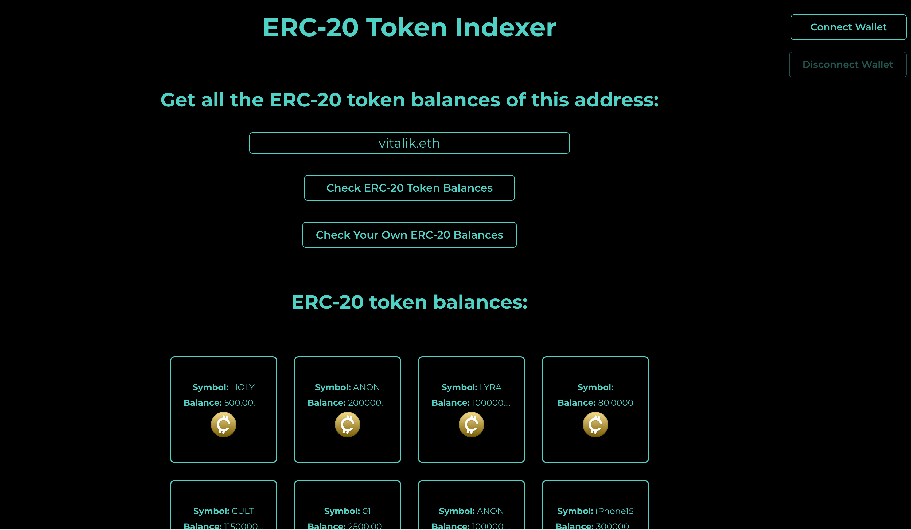

# Simple ERC-20 Indexer



This is an skeleton app that uses the Alchemy SDK rigged to Alchemy's Enhanced APIs in order to display all of an address's ERC-20 token balances.

## Set Up

1. Install dependencies by running `npm install`
2. Start application by running `npm run dev`

## Features

- `connectWallet()` implements ThirdWeb's React SDK uses the wallet connect modal to allow users to connect to any of the [supported wallets](https://portal.thirdweb.com/typescript/v5/supported-wallets)

- `disconnectWallet()` implements ThirdWeb's React SDK to disconnect the active wallet via `useActiveWallet()` and `useDisconnect()` hooks

- The following state hooks are used to maintain UX :
  ```jsx
  const [showNoWalletAlert, setShowNoWalletAlert] = useState(false); // Show alert if no wallet is connected
  const [showCustomErrorAlert, setShowCustomErrorAlert] = useState(false); // Show alert if an unexpected error occured and asks user to contact dev
  const [showUserDidNotConnect, setShowUserDidNotConnect] = useState(false); // Show alert if user did not connect
  const [shortenedAddress, setShortenedAddress] = useState(""); // shorten the wallet address so UI doesn't break
  const { connect, isConnecting } = useConnectModal(); // launch wallet connect modal
  const { disconnect } = useDisconnect(); // disconnect the active wallet
  const activeWallet = useActiveWallet(); // maintain the active wallet
  ```
- Refer to the global.html file in the output folder for detailed documentation
